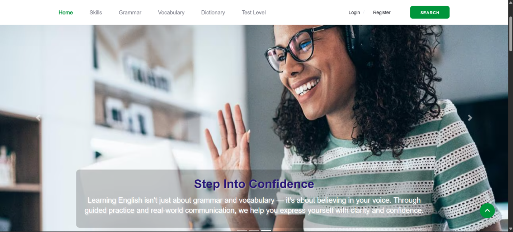
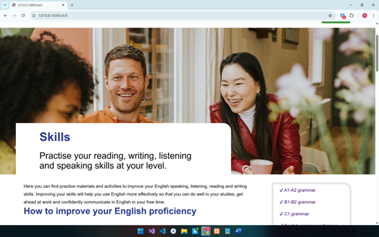
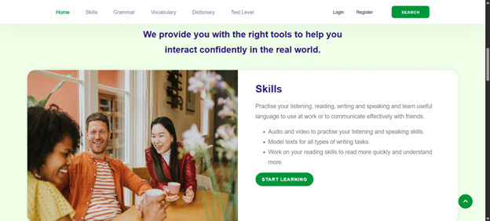
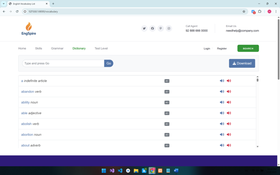
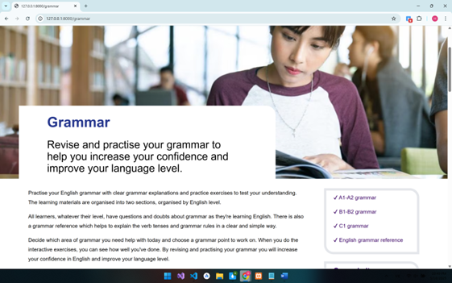
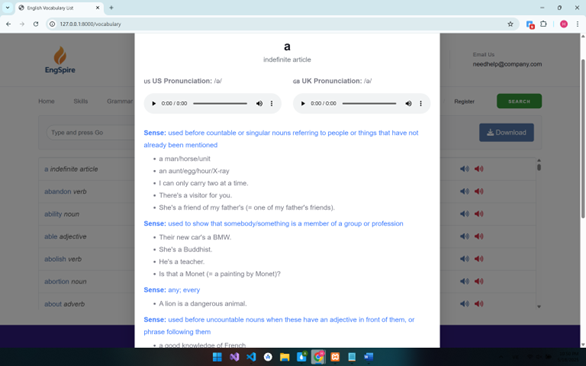
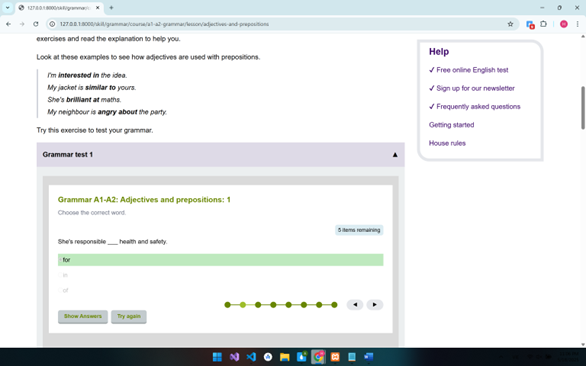
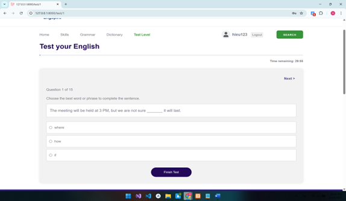
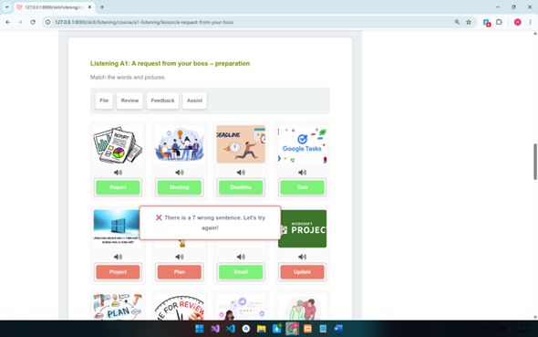

# 🌍 English Learning Master - E-Learning Platform

> A comprehensive web-based platform designed to make learning English engaging, effective, and interactive through games, quizzes, and structured lessons.


## 📖 Overview
**English Learning Master** is an educational website built to support students in mastering the English language. Unlike traditional methods, this platform combines theoretical lessons with **Gamification** (learning through games) to increase motivation and retention. Users can look up vocabulary, practice grammar, take tests, and track their skill progress.

## 🛠️ Tech Stack
* **Frontend:** HTML5, CSS3, JavaScript (Bootstrap/jQuery).
* **Backend:** Spring Boot (Java).
* **Database:** MySQL.
* **Tools:** Visual Studio Code, IntelliJ IDEA.

## 💻 Website Interface

<br>
<h3 align="center">🏠 Home & Core Skills</h3>
<p align="center">
  
  
  
</p>
<br>

<h2 align="center">🎮 INTERACTIVE LEARNING & TOOLS 📚</h2>

<br>
<h3 align="center">📖 Dictionary & Grammar Rules</h3>
<p align="center">
  
  
  
</p>
<br>

<br>
<h3 align="center">🏆 Games & Assessment</h3>
<p align="center">
  
  
  
</p>
<br>

## ✨ Key Features
1.  **Smart Dictionary:** Built-in lookup tool helping users find definitions and examples instantly.
2.  **Grammar Modules:** Structured lessons covering essential grammar rules.
3.  **Skill Development:** Focused exercises for Reading, Writing, Listening, and Speaking.
4.  **Gamification:** Interactive games (quizzes, puzzles) to make learning fun and less stressful.
5.  **Assessment System:** Regular tests to evaluate user progress and knowledge retention.

## 🚀 Installation & Setup
1.  Clone the repository:
    ```bash
    git clone [https://github.com/anicca3S84/English-Learning-Website.git](https://github.com/anicca3S84/English-Learning-Website.git)
    ```
2.  **Backend Setup:**
    * Open the backend project in IntelliJ IDEA.
    * Configure `application.properties` for your MySQL database.
    * Run the Spring Boot application.
3.  **Frontend Setup:**
    * Open the frontend folder in VS Code.
    * Open `index.html` (or run via Live Server).

---
